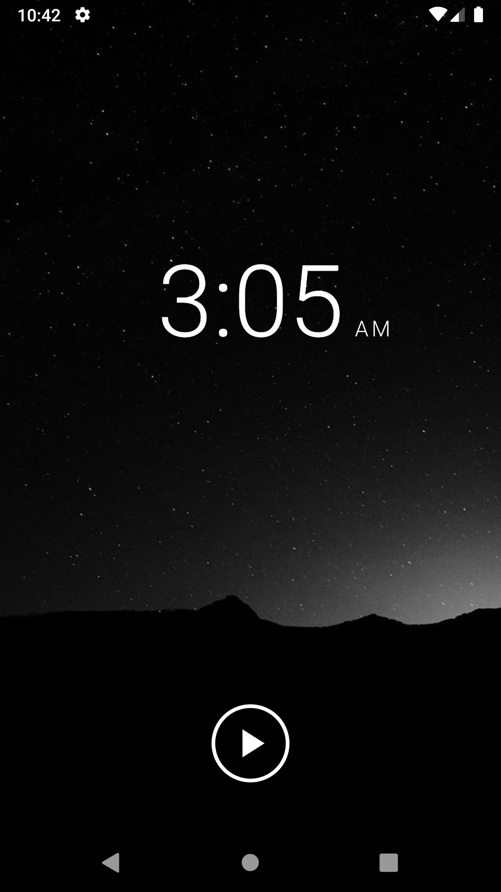
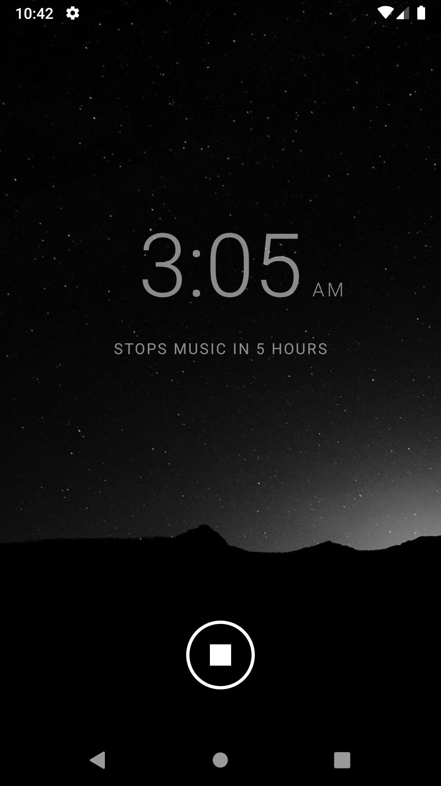
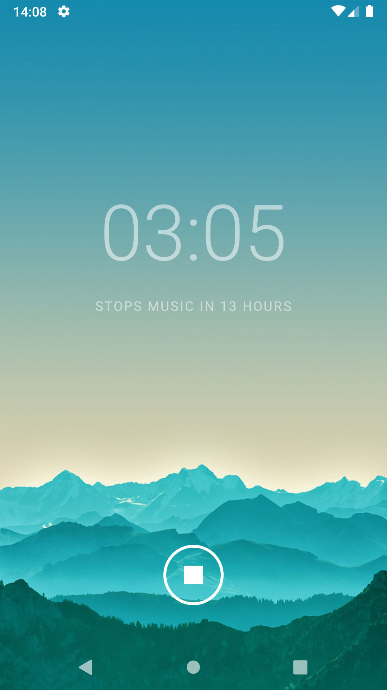

<div align=center>

</div>


## Description

An Android app that will stop all playing media on the phone at a set time

This project was inspired by wanting to play music as you relax late at night and have it turn off automatically after falling asleep. Unfortunately, the native Android alarm apps have no capability to do this.

<a href="https://source.android.com/setup/start/build-numbers" alt="Android Build">
    </a>

## Screenshots

 

 

## Getting Started

### Prerequisites

Download and install [Android Studio](https://developer.android.com/studio/)

### Installing

Import the cloned project into Android Studio

Build and run on a AVD emulator

## Deployment

Side load the signed release apk onto your phone
```
adb install drift_off_java.apk
```

## Built With

* [Dagger](https://dagger.dev) - Static Android Dependency Injection
* [Gradle](https://gradle.org) - Dependency Management and Build Tool

## Testing

* [Espresso](https://developer.android.com/training/testing/espresso/) - Android UI Testing Framework
* [Mockito](https://site.mockito.org) - Java Mocking Framework

## Versioning

For the versions available, see the [tags on this repository](https://github.com/jtymburski/drift-off-java/tags). 

## Authors

* **Jordan Tymburski** - [Portfolio](https://jordantymburski.com/)

## License

This project is licensed under the MIT License - see the [LICENSE](LICENSE) file for details

## Acknowledgments

* **Sarah Chou** - [A very talented designer](https://sarahchou.com/)
